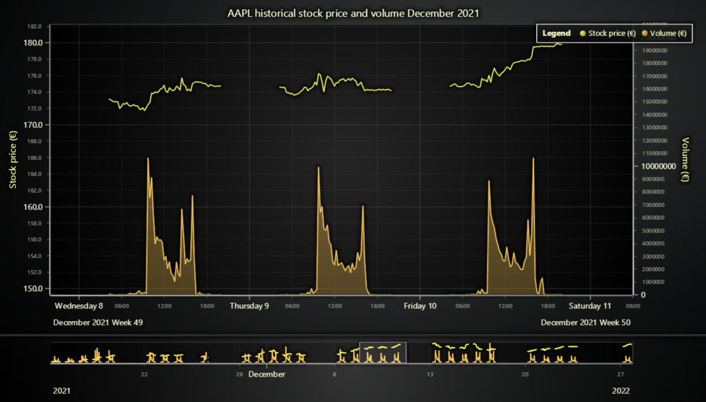
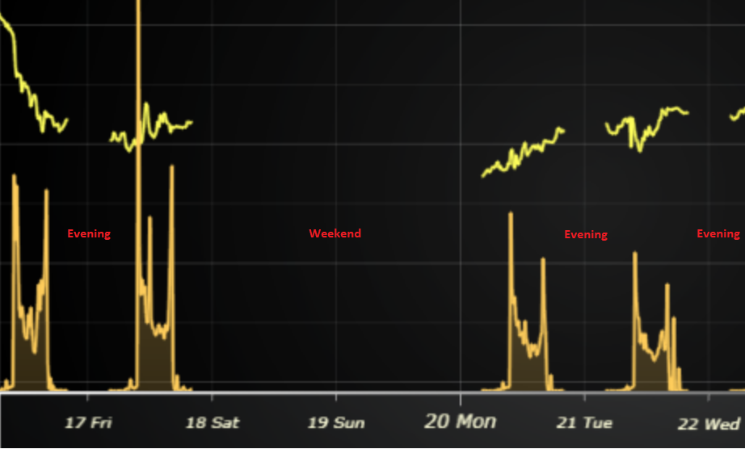

# JavaScript Data Gaps Trading Chart

This demo application belongs to the set of examples for LightningChart JS, data visualization library for JavaScript.

LightningChart JS is entirely GPU accelerated and performance optimized charting library for presenting massive amounts of data. It offers an easy way of creating sophisticated and interactive charts and adding them to your website or web application.

The demo can be used as an example or a seed project. Local execution requires the following steps:

-   Make sure that relevant version of [Node.js](https://nodejs.org/en/download/) is installed
-   Open the project folder in a terminal:

          npm install              # fetches dependencies
          npm start                # builds an application and starts the development server

-   The application is available at _http://localhost:8080_ in your browser, webpack-dev-server provides hot reload functionality.

## Description

Normally, series types such as `LineSeries`, `AreaSeries`, etc. automatically connect data points to highlight the progression of trend values. In some specific use cases, this is not the ideal behavior. One such use case is trading data visualization, which is also the setting for this particular.

Trading data often contains frequent _data gaps_, meaning relatively large time intervals when there are no data samples available. These correspond to times when the market is "closed", evenings and weekends.

[//]: # 'IMPORTANT: The assets will not show before README.md is built - relative path is different!'

In LightningChart JS, data gaps can be specified by adding an extra data point with value of `NaN` (_Not-A-Number_).

[//]: # 'IMPORTANT: The assets will not show before README.md is built - relative path is different!'

The code of this example shows one way of automatically detecting gaps in data sets and adding the `NaN` data points in. By default it looks for 1 hour difference between two data points, but this can be easily modified.

## API Links

* [Lightning chart]
* [Chart XY]
* [Axis]
* [Dashboard]
* [Line series]
* [Area series]
* [Axis tick strategies]
* [Legend box]
* [Zoom band chart]

## Support

If you notice an error in the example code, please open an issue on [GitHub][0] repository of the entire example.

Official [API documentation][1] can be found on [LightningChart][2] website.

If the docs and other materials do not solve your problem as well as implementation help is needed, ask on [StackOverflow][3] (tagged lightningchart).

If you think you found a bug in the LightningChart JavaScript library, please contact support@lightningchart.com.

Direct developer email support can be purchased through a [Support Plan][4] or by contacting sales@lightningchart.com.

[0]: https://github.com/Arction/
[1]: https://lightningchart.com/lightningchart-js-api-documentation/
[2]: https://lightningchart.com
[3]: https://stackoverflow.com/questions/tagged/lightningchart
[4]: https://lightningchart.com/support-services/

© LightningChart Ltd 2009-2022. All rights reserved.

[Lightning chart]: https://lightningchart.com/lightningchart-js-api-documentation/v4.0.0/functions/lightningChart-1.html
[Chart XY]: https://lightningchart.com/lightningchart-js-api-documentation/v4.0.0/classes/ChartXY.html
[Axis]: https://lightningchart.com/lightningchart-js-api-documentation/v4.0.0/classes/Axis.html
[Dashboard]: https://lightningchart.com/lightningchart-js-api-documentation/v4.0.0/classes/Dashboard.html
[Line series]: https://lightningchart.com/lightningchart-js-api-documentation/v4.0.0/classes/LineSeries.html
[Area series]: https://lightningchart.com/lightningchart-js-api-documentation/v4.0.0/classes/AreaSeriesPositive.html
[Axis tick strategies]: https://lightningchart.com/lightningchart-js-api-documentation/v4.0.0/variables/AxisTickStrategies.html
[Legend box]: https://lightningchart.com/lightningchart-js-api-documentation/v4.0.0/classes/Chart.html#addLegendBox
[Zoom band chart]: https://lightningchart.com/lightningchart-js-api-documentation/v4.0.0/classes/ZoomBandChart.html

